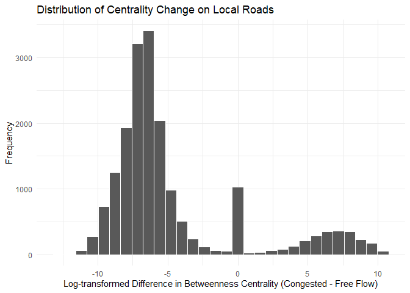
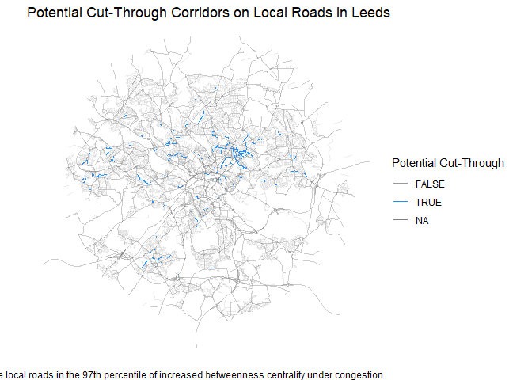

# Cut-through corridors identification (Simple version)


### Overview

Identifying cut-through routes, commonly known as rat-runs, is a crucial
step in transport model development, as recommended in the Department
for Transport’s guidance (TAG Unit M3.1). Traditionally, this process
relies heavily on local knowledge, which may not always be accessible.
This reproducible workflow implemented in R utilises open data and
network analysis techniques to identify these routes efficiently, even
in the absence of detailed local insights.

## Set-up

We will use the following packages for the analysis and to produce the
outputs

We will take Leeds to exemplify the process.

``` r
selected_zones <- zonebuilder::zb_zone("Leeds",n_circles = 4)

zones_wkt <- selected_zones |>
  st_union() |>
  st_convex_hull() |>
  st_transform(27700) |> 
  st_as_text()
```

We will assume that all roads, have speed limits based on their types.
Richer datasets might provide more detailed information, for example
OSM. For the congested conditions, we will assume a reduction of 10 mph
for the Motorways, A roads and B roads in the network.

``` r
custom_wp <- tibble(
  road_function = c("Local Road", "Minor Road", "B Road", "A Road",
                    "Motorway"),
  speed_ff = round(c(20,20,30,40,70)*(0.44704),5),
  speed_cg = round(c(20,20,20,30,60)*(0.44704),5),
  )
```

For the road network, we will use OS OpenRoads available
[here](https://www.ordnancesurvey.co.uk/products/os-open-roads).

``` r
selected_network <- st_read(
  "00_data/oproad_gb.gpkg",
  wkt_filter = zones_wkt,
  query = "SELECT * FROM \"road_link\" WHERE road_function NOT LIKE '%access%'") |> 
  left_join(custom_wp,by = "road_function") |> 
    # We calculate travel times for all corridors in both free-flow (speed-limit) and congested conditions (10n mph lower)
  mutate(
    tra_time_ff = length/speed_ff,
    tra_time_cg = length/speed_cg
         )
```

    Reading query `SELECT * FROM "road_link" WHERE road_function NOT LIKE '%access%''
    from data source `C:\temp_jf\MW-rapid-cut-through\00_data\oproad_gb.gpkg' using driver `GPKG'
    Re-reading with feature count reset from 33542 to 29003
    Simple feature collection with 29003 features and 20 fields
    Geometry type: LINESTRING
    Dimension:     XY
    Bounding box:  xmin: 418542.3 ymin: 421364.6 xmax: 441664.4 ymax: 443596
    Projected CRS: OSGB36 / British National Grid

A quick visualisation of the data we will be using:

    Warning in grid.Call(C_stringMetric, as.graphicsAnnot(x$label)): font family
    not found in Windows font database
    Warning in grid.Call(C_stringMetric, as.graphicsAnnot(x$label)): font family
    not found in Windows font database

    Warning in grid.Call(C_textBounds, as.graphicsAnnot(x$label), x$x, x$y, : font
    family not found in Windows font database

    Warning in grid.Call.graphics(C_text, as.graphicsAnnot(x$label), x$x, x$y, :
    font family not found in Windows font database


We will produce a graph representation of the network with the
`sfnetworks` package.

``` r
net = as_sfnetwork(selected_network)

net_simplified = convert(net,
                         to_spatial_smooth,
                         summarise_attributes = list(length = "sum",
                                                     tra_time_ff = "sum",
                                                     tra_time_cg = "sum",
                                                     "first"
                                                     ),
                         require_equal = "road_function")
```

We calculate the betweenness centrality for the baseline (free flow) and
the congested state. And finally, we compare them

``` r
E(net_simplified)$centrality_ff <- edge_betweenness(
  net_simplified,
  directed = F,
  weights = E(net_simplified)$tra_time_ff,
  cutoff = 5*60)

E(net_simplified)$centrality_cg <- edge_betweenness(
  net_simplified,
  directed = F,
  weights = E(net_simplified)$tra_time_cg,
  cutoff = 5*60)

net_centrality <- net_simplified |> 
  activate(edges) |> 
  mutate(diff_bc = centrality_cg - centrality_ff,
         log_diff = if_else(diff_bc!=0,
                            (diff_bc/abs(diff_bc))*log(abs(diff_bc)),0
                            ))
```

Let’s visualise the different changes in centrality for local roads

``` r
sf_edges <- st_as_sf(net_centrality, "edges") |> 
  mutate(road_function = factor(road_function,
                                levels = road_levels,
                                ordered = T))

sf_edges |>
    filter(road_function == "Local Road") |> 
    ggplot(aes(log_diff))+
    geom_histogram(col = "white")+
    theme_minimal()
```

    `stat_bin()` using `bins = 30`. Pick better value with `binwidth`.




    Under congested conditions, most local roads loose *importance* as the major roads provide less connectivity. However, a portion of them become more important as they provide quicker routes for drivers, potentially indicating a cut-through corridor.

    We can explore the location of such corridors. These are the links with the highest values (97th percentile).


    ::: {.cell}

    ```{.r .cell-code}
    cut_map <- sf_edges |>
        mutate(log_diff = if_else(road_function %in% c("Local Road"),log_diff,NA_real_)) |>
         mutate(log_diff_p95 = log_diff > quantile(log_diff,0.97,na.rm = T)) |> 
        ggplot()+
      geom_sf(aes(col = log_diff_p95,
                  linewidth = road_function,
                  alpha = log_diff_p95
                  ))+
      theme_void()+
      labs(col = "Potential Cut-Through")+
      scale_color_manual(values = c("gray60","dodgerblue"))+
      scale_linewidth_manual(values = 1/c(1.5,1.8,2.05,2.5,2.1),guide = 'none')+
      scale_alpha_manual(
        values = c(0.2,1),guide = 'none',na.value = 0.4
        )+
      guides(col=guide_legend(nrow=3,byrow=TRUE))+
      theme(text = element_text(family = "Roboto Condensed"), legend.position = "right")

    cut_map

<div class="cell-output cell-output-stderr">

    Warning in grid.Call(C_textBounds, as.graphicsAnnot(x$label), x$x, x$y, : font
    family not found in Windows font database
    Warning in grid.Call(C_textBounds, as.graphicsAnnot(x$label), x$x, x$y, : font
    family not found in Windows font database

</div>

<div class="cell-output cell-output-stderr">

    Warning in grid.Call.graphics(C_text, as.graphicsAnnot(x$label), x$x, x$y, :
    font family not found in Windows font database

</div>

<div class="cell-output-display">



</div>

``` r
ggsave(plot = cut_map,filename = "cut_map.png",dpi = 320,width = 24,height = 14,units = "cm")
```

:::
