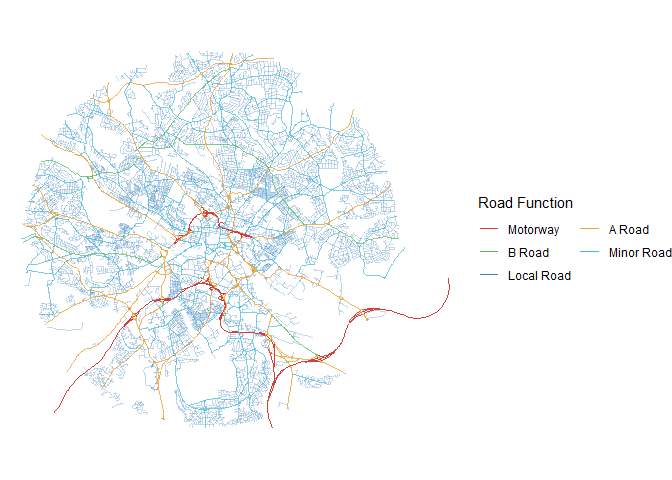

# Parallel Test


## Set-up

``` r
options(repos = c(CRAN = "https://cloud.r-project.org"))
if (!require("remotes")) {
  install.packages("remotes")
}
pkgs = c(
  "sf",
  "tidyverse",
  "zonebuilder",
  "tmap",
  "sfnetworks",
  "tidygraph",
  "igraph",
  "paletteer",
  "future.apply",
  "parallelly"
)
remotes::install_cran(pkgs)
sapply(pkgs, require, character.only = TRUE)
```

``` r
sapply(pkgs, packageVersion)
```

    $sf
    [1]  1  0 21

    $tidyverse
    [1] 2 0 0

    $zonebuilder
    [1] 0 1 0

    $tmap
    [1] 4 2

    $sfnetworks
    [1] 0 6 5

    $tidygraph
    [1] 1 3 1

    $igraph
    [1] 2 1 4

    $paletteer
    [1] 1 6 0

    $future.apply
    [1]  1 20  0

    $parallelly
    [1]  1 45  1

## Select Study Area

``` r
selected_zones <- zonebuilder::zb_zone(
  "Leeds",
  n_segments = 8,
  n_circles = 3
) |>
  st_transform(27700)

# We then create a Well-Known Text (WKT) representation of the convex hull of these zones.
# This WKT filter will be used later to select network data only within our area of interest.
zones_wkt <- selected_zones |>
  st_union() |>
  st_convex_hull() |>
  st_as_text()
```

``` r
custom_wp <- tibble(
  road_function = c("Local Road", "Minor Road", "B Road", "A Road", "Motorway"),
  speed_ff = round(c(20, 20, 30, 40, 70) * (0.44704), 5),
  speed_cg = round(c(20, 20, 20, 30, 60) * (0.44704), 5),
)
```

## Road Network Data

``` r
if (!file.exists("00_data/oproad_gpkg_gb.zip")) {
  dir.create("00_data", showWarnings = F)
  u <- "https://api.os.uk/downloads/v1/products/OpenRoads/downloads?area=GB&format=GeoPackage&redirect"
  options(timeout = 360)
  download.file(u, destfile = "00_data/oproad_gpkg_gb.zip", mode = "wb")
  unzip("00_data/oproad_gpkg_gb.zip", exdir = "00_data")
}
```

``` r
selected_network <- st_read(
  "00_data/Data/oproad_gb.gpkg",
  wkt_filter = zones_wkt,
  query = "SELECT * FROM \"road_link\" WHERE road_function NOT LIKE '%access%'"
) |>
  left_join(custom_wp, by = "road_function") |>
  # With the speeds assigned, we can calculate travel times for each road segment.
  # We calculate travel times for both free-flow (speed-limit) and congested conditions.
  mutate(
    tra_time_ff = length / speed_ff, # Travel time in free-flow (seconds)
    tra_time_cg = length / speed_cg # Travel time in congested conditions (seconds)
  )
```

    Reading query `SELECT * FROM "road_link" WHERE road_function NOT LIKE '%access%''
    from data source `C:\temp_jf\MW-rapid-cut-through\00_data\Data\oproad_gb.gpkg' 
      using driver `GPKG'
    Re-reading with feature count reset from 20186 to 17111
    Simple feature collection with 17111 features and 20 fields
    Geometry type: LINESTRING
    Dimension:     XY
    Bounding box:  xmin: 424005 ymin: 427448.2 xmax: 437782 ymax: 439618
    Projected CRS: OSGB36 / British National Grid

Let’s take a quick look at the road network we’ve prepared. The map
below shows the different types of roads in our Leeds study area.



``` r
zones_list <- st_intersects(selected_network, selected_zones) |>
  vapply(\(x) head(x, 1), numeric(1))
```

``` r
split_roads <- split(selected_network, zones_list)
```

``` r
number_of_cores <- availableCores()
plan(multisession, workers = floor(number_of_cores / 2))
```

``` r
smooth_net <- function(X) {
  X |>
    sfnetworks::as_sfnetwork() |>
    tidygraph::convert(
      sfnetworks::to_spatial_smooth,
      summarise_attributes = list(
        length = "sum",
        tra_time_ff = "sum",
        tra_time_cg = "sum",
        "first" # Keep the first value for other attributes
      ),
      require_equal = "road_function"
    )
}
```

``` r
microbenchmark::microbenchmark(
  std_lapply = {
    lapply(split_roads, smooth_net)
  },
  with_future = {
    future_lapply(
      split_roads,
      smooth_net,
      future.globals = FALSE,
      future.seed = TRUE,
      future.chunk.size = Inf,
      future.stdout = FALSE
    )
  },
  times = 5
)
```

    Unit: seconds
            expr      min       lq     mean   median       uq      max neval
      std_lapply 8.010112 10.97748 10.94937 11.58606 11.89471 12.27847     5
     with_future 9.795426  9.90951 12.70636 11.00201 11.93133 20.89353     5
